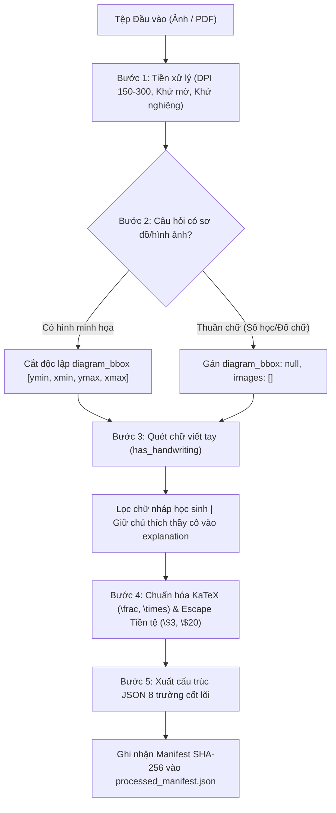
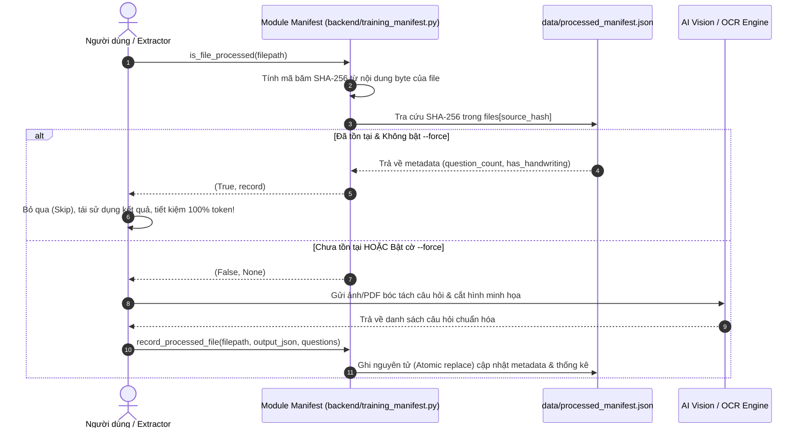

# EDUQUEST PRO — HƯỚNG DẪN CHUẨN HÓA DỮ LIỆU ĐÀO TẠO (TRAINING DATA GUIDE)
*Tài liệu Tiêu chuẩn Kỹ thuật & Kim chỉ nam bóc tách Đề thi từ Ảnh / PDF sang JSON*

---

## MỤC LỤC
1. [Tổng quan & Tiêu chuẩn Dữ liệu Huấn luyện EduQuest Pro](#1-tổng-quan--tiêu-chuẩn-dữ-liệu-huấn-luyện-eduquest-pro)
2. [Quy trình 5 Bước Bóc Tách Chuẩn Hóa từ Ảnh / PDF sang JSON](#2-quy-trình-5-bước-bóc-tách-chuẩn-hóa-từ-ảnh--pdf-sang-json)
   - [Bước 1: Tiếp nhận và Tiền xử lý (Preprocessing)](#bước-1-tiếp-nhận-và-tiền-xử-lý-preprocessing)
   - [Bước 2: Phân tích Vùng đề bài & Cắt Hình minh họa Độc lập (Bounding Box Crop Rules)](#bước-2-phân-tích-vùng-đề-bài--cắt-hình-minh-họa-độc-lập-bounding-box-crop-rules)
   - [Bước 3: Nhận diện & Xử lý Chữ viết tay (`has_handwriting`)](#bước-3-nhận-diện--xử-lý-chữ-viết-tay-has_handwriting)
   - [Bước 4: Chuẩn hóa Công thức Toán học KaTeX & Ký hiệu Tiền tệ](#bước-4-chuẩn-hóa-công-thức-toán-học-katex--ký-hiệu-tiền-tệ)
   - [Bước 5: Xuất Cấu trúc JSON Chuẩn 8 Trường Cốt lõi](#bước-5-xuất-cấu-trúc-json-chuẩn-8-trường-cốt-lõi)
3. [Bảng Quy chuẩn Phân loại Khối lớp, Bộ môn & Độ khó](#3-bảng-quy-chuẩn-phân-loại-khối-lớp-bộ-môn--độ-khó)
4. [Hệ thống Manifest Chống Xử lý Trùng lặp (`processed_manifest.json`)](#4-hệ-thống-manifest-chống-xử-lý-trùng-lặp-processed_manifestjson)
5. [Danh mục Lỗi thường gặp & Giải pháp Khắc phục (Troubleshooting & Anti-patterns)](#5-danh-mục-lỗi-thường-gặp--giải-pháp-khắc-phục-troubleshooting--anti-patterns)

---

## 1. TỔNG QUAN & TIÊU CHUẨN DỮ LIỆU HUẤN LUYỆN EDUQUEST PRO

### 1.1. Sứ mệnh Dữ liệu
EduQuest Pro là nền tảng Khảo thí & Luyện thi Thông minh thế hệ mới, phục vụ học sinh từ cấp **Mầm non (Tiền tiểu học)**, **Tiểu học**, **Trung học cơ sở** đến **Trung học phổ thông**. Để huấn luyện các mô hình AI gia sư cũng như cung cấp trải nghiệm làm bài tương tác trực quan cho học sinh, kho dữ liệu đề thi bắt buộc phải đạt độ chuẩn hóa và độ chính xác tuyệt đối.

### 1.2. Bộ Tiêu chuẩn "Zero-Garbage" (Không rác dữ liệu)
Mọi câu hỏi được bóc tách từ tài liệu in, ảnh scan, tài liệu chụp di động hoặc tệp PDF đề thi phải thỏa mãn nghiêm ngặt 5 nguyên tắc sau:
1. **Tính độc lập ngữ nghĩa**: Mỗi câu hỏi trong cơ sở dữ liệu phải tự chứa đầy đủ ngữ cảnh để học sinh có thể làm bài độc lập. Không bị phụ thuộc vào câu hỏi trước/sau trừ bài đọc hiểu lớn.
2. **Loại bỏ 100% rác thừa (Anti-Watermark & Noise)**: Xóa triệt để các thông tin tiếp thị như số điện thoại trung tâm, hotline, tài khoản Facebook, tên watermark, số trang, tiêu đề đầu trang (header) và chân trang (footer).
3. **Bảo toàn tính song ngữ & ký hiệu**: Với các đề thi toán Olympic quốc tế (TIMO, HKIMO, SASMO, Kangaroo, ASMO), bắt buộc giữ trọn vẹn cả đoạn đề tiếng Anh và phần dịch thuật tiếng Việt, không dịch lược bớt thông số.
4. **Lời giải sư phạm chuẩn mực (`explanation`)**: Không chỉ đưa ra kết quả, phần giải thích phải trình bày từng bước tư duy phù hợp với lứa tuổi của khối lớp tương ứng (diễn giải trực quan cho Mầm non/Lớp 1, lập luận quy luật cho Lớp 2-5).
5. **Độc lập hóa sơ đồ hình ảnh**: Tuyệt đối không crop cả trang ảnh chụp đề bài. Chỉ trích xuất riêng biệt phần sơ đồ minh họa trọng tâm nếu câu hỏi thực sự cần hình để suy luận.

---

## 2. QUY TRÌNH 5 BƯỚC BÓC TÁCH CHUẨN HÓA TỪ ẢNH / PDF SANG JSON



---

### Bước 1: Tiếp nhận và Tiền xử lý (Preprocessing)

Để đạt tỷ lệ nhận dạng quang học (OCR) và hiểu thị giác (Vision LLM) cao nhất:
1. **Độ phân giải chuẩn hóa**:
   - Ảnh scan/chụp: Khuyến nghị **150 đến 300 DPI**.
   - Nếu ảnh có kích thước quá lớn (> 2048px chiều ngang/dọc), tự động điều chỉnh tỷ lệ (resize LANCZOS) với chiều dài tối đa 2048px để tối ưu hóa thời gian truyền tải và tiết kiệm token mà vẫn giữ độ nét chữ in.
2. **Đo độ sắc nét & Khử mờ (Blur Check)**:
   - Sử dụng phương sai toán tử Laplacian ($\sigma^2_{Laplacian}$).
   - Nếu $\sigma^2 < 100$, cảnh báo ảnh chụp bị rung tay/mất nét và yêu cầu chụp lại hoặc chuyển sang mô hình siêu phân giải.
3. **Khử nghiêng (Deskew) & Xoay trang thẳng góc**:
   - Tự động phát hiện góc xoay (Orientation Detection: 0°, 90°, 180°, 270°).
   - Xoay ảnh về trục chuẩn nằm ngang để đảm bảo các dòng chữ song song với viền khung hình trước khi bóc tách.

---

### Bước 2: Phân tích Vùng đề bài & Cắt Hình minh họa Độc lập (Bounding Box Crop Rules)

> [!CAUTION]
> **QUY TẮC SỐNG CÒN (CRITICAL CROP RULE):**
> 1. **TUYỆT ĐỐI KHÔNG CROP NGUYÊN CẢ TRANG ĐỀ THI** hoặc crop cả khối chữ đề bài vào trường `images` khi câu hỏi chỉ là bài toán thuần chữ (ví dụ: bài toán đố tính tuổi, phép tính số học $12 + 15$, bài đọc hiểu). Trong trường hợp này, `diagram_bbox` BẮT BUỘC là `null` và `images` là mảng rỗng `[]`.
> 2. **CHỈ CROP ĐỘC LẬP** các sơ đồ, hình học, bảng dữ liệu, hình minh họa thực sự cần thiết mà học sinh bắt buộc phải nhìn hình mới làm được bài (ví dụ: quả táo, đĩa cân, tia số, khối lập phương, que tính, đồng hồ kim, đồ thị).

#### Quy chuẩn Tọa độ Bounding Box `[ymin, xmin, ymax, xmax]`
Tọa độ được chuẩn hóa theo thang đo tỉ lệ từ `0` đến `1000` của toàn trang ảnh:

| Tọa độ | Định vị Bắt buộc | Lưu ý Kỹ thuật |
| :--- | :--- | :--- |
| **`ymin` (Cạnh trên)** | Nằm ngay dưới dòng chữ cuối cùng của đề bài. | **Tuyệt đối không chứa dòng chữ câu hỏi** (cả tiếng Anh lẫn tiếng Việt). |
| **`ymax` (Cạnh dưới)** | Kéo dài bao trùm hết mọi chi tiết của hình vẽ **VÀ TẤT CẢ CÁC NHÃN/CHÚ THÍCH** bên dưới hình. | **Không cắt cụt chân hình vẽ**. Phải chứa các nhãn: *"Group 1 / Nhóm 1"*, *"Hình 1"*, *"Đĩa A"*. Dừng lại trước hàng phương án A, B, C, D. |
| **`xmin` (Cạnh trái)** | Bao sát mép ngoài cùng bên trái của cụm hình ảnh. | Giữ khoảng lề biên (padding) từ 5-10 pixel. |
| **`xmax` (Cạnh phải)** | Bao trọn vẹn toàn bộ bề ngang của cụm hình minh họa. | Đảm bảo bao trùm tất cả các cột/nhóm hình vẽ thành phần. |

#### Tinh chỉnh Tự động bằng Mật độ Điểm ảnh (Contour Density Refinement)
Hệ thống sử dụng module `backend/image_cropper.py` với hàm `refine_diagram_bbox()` để phân tích biểu đồ mật độ pixel tối:
- Tự động tách bỏ các dòng chữ mỏng sót lại ở phía trên (`height < 30px`).
- Mở rộng xuống dưới để thu trọn vẹn các nhãn mô tả (`gap <= 25px`).
- Tự động lưu hình ảnh đã cắt độc lập vào thư mục `data/media/crop_diag_q{num}_{uuid}.png` và gán URL `/media/...` vào trường `images` của câu hỏi.

---

### Bước 3: Nhận diện & Xử lý Chữ viết tay (`has_handwriting`)

Đề thi thu thập từ tài liệu photo hoặc đề thi học sinh đã làm thường xuất hiện vết bút chì, bút bi mực xanh/đỏ hoặc nét vẽ tay nguệch ngoạc.

#### Ý nghĩa Trường `has_handwriting`
- Kiểu dữ liệu: `boolean` (`true` hoặc `false`).
- Gán `true` khi phát hiện:
  - Có nét chữ viết tay, phép tính nháp ngoài lề.
  - Có dấu khoanh tròn đáp án (vòng bút bi vào phương án A, B, C hoặc D).
  - Có dấu tích ($\checkmark$, $\times$) hoặc chữ giáo viên ghi điểm/chú thích.

#### Quy tắc Xử lý Chữ viết tay
1. **Phân loại Chữ nháp của Học sinh**:
   - **LOẠI BỎ TRIỆT ĐỂ**: Không để các phép tính nháp (ví dụ: "$9 + 4 = 13$", "$25 \times 4$") lọt vào nội dung câu hỏi `question_text`.
   - **KHÔNG TIN TƯỞNG DẤU KHOANH TRÊN ĐỀ CŨ**: Rất nhiều đề thi có dấu khoanh đáp án của học sinh bị **SAI**. AI bắt buộc phải tự giải lại bài toán từ đầu để xác định `correct_answer` chính xác dựa trên logic toán học.
2. **Phân loại Lời phê / Ghi chú Sửa bài của Thầy cô**:
   - Nếu giáo viên viết lời giải chi tiết hoặc chỉ ra mẹo tư duy bên cạnh bài toán, AI tiến hành chuẩn hóa nội dung đó và tích hợp vào trường `explanation` sư phạm.

---

### Bước 4: Chuẩn hóa Công thức Toán học KaTeX & Ký hiệu Tiền tệ

#### 4.1. Quy tắc Bảo vệ Ký hiệu Tiền tệ (Currency Escaping)
Trong các đề thi toán tiếng Anh và toán tiểu học, ký hiệu tiền tệ đô la (`$`) xuất hiện rất thường xuyên (ví dụ: `$3`, `$20`, `$1.5`).
> [!WARNING]
> Nếu không xử lý, trình render web KaTeX/MathJax sẽ hiểu nhầm hai dấu `$` trong cùng đoạn văn bản thành cặp mở/đóng khối toán học (Inline Math Delimiter), dẫn đến việc vỡ toàn bộ cấu trúc giao diện trang web!

**Quy tắc chuẩn hóa:**
- Viết dấu gạch chéo ngược trước ký hiệu đô la: `\$3`, `\$20`, `\$100`.
- Hoặc để trong thẻ đơn vị rõ ràng: `3 USD`, `20 đô la`, `50.000 VNĐ`.

#### 4.2. Bảng Chuẩn Cú pháp KaTeX cho Đề thi Tiểu học & Phổ thông

| Thành phần Toán học | Cú pháp KaTeX Chuẩn | Ví dụ Thực tế | Hiển thị Dự kiến |
| :--- | :--- | :--- | :--- |
| **Phân số** | `\frac{tử}{mẫu}` | `\frac{3}{4} + \frac{1}{2}` | $\frac{3}{4} + \frac{1}{2}$ |
| **Hỗn số** | `a\frac{b}{c}` | `2\frac{1}{3}` | $2\frac{1}{3}$ |
| **Phép nhân** | `\times` hoặc `\cdot` | `5 \times 8 = 40` | $5 \times 8 = 40$ |
| **Phép chia** | `\div` hoặc `:` | `48 \div 6 = 8` | $48 \div 6 = 8$ |
| **Lũy thừa / Số mũ** | `a^{b}` | `x^2 + 5x + 6 = 0` | $x^2 + 5x + 6 = 0$ |
| **Chỉ số dưới** | `a_{b}` | `u_1 + u_2 = 10` | $u_1 + u_2 = 10$ |
| **Căn thức** | `\sqrt{x}` hoặc `\sqrt[n]{x}` | `\sqrt{64} = 8` | $\sqrt{64} = 8$ |
| **So sánh** | `\le`, `\ge`, `\neq` | `x \ge 0`, `a \neq b` | $x \ge 0, a \neq b$ |
| **Hình học** | `\triangle`, `\angle`, `\perp` | `\triangle ABC`, `\angle BAC = 90^\circ` | $\triangle ABC, \angle BAC = 90^\circ$ |
| **Hệ đơn vị & Góc** | `^\circ`, `cm^2`, `m^3` | `30^\circ`, `45\text{ cm}^2` | $30^\circ, 45\text{ cm}^2$ |

*Lưu ý: Tuyệt đối không dùng chữ `x` thường để biểu thị phép nhân (như `5 x 8`), vì học sinh sẽ nhầm lẫn với ẩn số $x$. Bắt buộc dùng `\times`.*

---

### Bước 5: Xuất Cấu trúc JSON Chuẩn 8 Trường Cốt lõi

Mỗi câu hỏi được trích xuất hoàn chỉnh phải tuân thủ schema JSON sau:

```json
[
  {
    "id": "train_a1b2c3d4e5",
    "question_number": 2,
    "content_text": "According to the pattern shown below, how many apples are there in the next group?\nDựa vào quy luật dưới đây, có bao nhiêu quả táo trong nhóm tiếp theo?",
    "content_html": "<p>According to the pattern shown below, how many apples are there in the next group?<br/>Dựa vào quy luật dưới đây, có bao nhiêu quả táo trong nhóm tiếp theo?</p>",
    "options": [
      {
        "id": "A",
        "content": "0",
        "is_correct": true
      },
      {
        "id": "B",
        "content": "1",
        "is_correct": false
      },
      {
        "id": "C",
        "content": "2",
        "is_correct": false
      },
      {
        "id": "D",
        "content": "3",
        "is_correct": false
      }
    ],
    "correct_answer": "A",
    "explanation": "Bước 1: Quan sát số lượng quả táo ở từng nhóm:\n- Nhóm 1: Có 3 quả táo.\n- Nhóm 2: Có 2 quả táo (giảm đi 1 quả so với nhóm 1).\n- Nhóm 3: Có 1 quả táo (giảm đi 1 quả so với nhóm 2).\nBước 2: Tìm quy luật của dãy số:\nSố lượng quả táo giảm dần 1 đơn vị qua mỗi nhóm: 3, 2, 1, ...\nBước 3: Xác định số quả táo ở nhóm tiếp theo (Nhóm 4):\n1 - 1 = 0 (quả táo).\nVậy đáp án đúng là phương án A (0 quả).",
    "grade": 2,
    "subject": "math",
    "difficulty": "medium",
    "has_handwriting": false,
    "images": [
      "/media/crop_diag_q2_978b277ff9.png"
    ],
    "diagram_bbox": [280.5, 95.0, 520.4, 905.0],
    "topic": "Bóc tách AI Vision (Toán tư duy)",
    "source_platform": "ai_vision",
    "source_file_name": "FB_IMG_1791115073510.jpg",
    "exam_name": "TIMO Mock Test - Level 2",
    "source_detail": "Tài liệu TIMO Premium",
    "created_at": "2026-10-10T16:38:17+07:00"
  }
]
```

#### Giải thích Chi tiết 8 Trường Cốt lõi:
1. `content_text`: Văn bản câu hỏi đầy đủ, sạch sẽ, không chứa số thứ tự ("Câu 1.", "1.") và không chứa các lựa chọn A, B, C, D.
2. `options`: Mảng gồm 4 phần tử với khóa `id` ("A", "B", "C", "D"), `content` (nội dung tinh gọn, không tiền tố) và `is_correct` (boolean).
3. `correct_answer`: Chữ cái đại diện cho đáp án chính xác ("A", "B", "C" hoặc "D").
4. `explanation`: Lời giải sư phạm chi tiết từng bước (Bước 1, Bước 2, Bước 3, Kết luận).
5. `grade`: Số nguyên đại diện cho khối lớp từ `0` đến `12`.
6. `subject`: Mã môn học chuẩn hóa theo bảng quy ước.
7. `difficulty`: Mức độ phân hóa câu hỏi (`easy`, `medium`, `hard`, `olympiad`).
8. `has_handwriting`: Cờ boolean đánh dấu sự hiện diện của chữ viết tay/mực vẽ trên ảnh gốc.
9. `images`: Mảng danh sách đường dẫn ảnh minh họa độc lập (hoặc `[]` nếu thuần chữ).

---

## 3. BẢNG QUY CHUẨN PHÂN LOẠI KHỐI LỚP, BỘ MÔN & ĐỘ KHÓ

### 3.1. Bảng Phân cấp Khối lớp (`grade`)

| Mã `grade` | Tên Khối lớp | Độ tuổi | Đặc trưng Nội dung & Khảo thí |
| :---: | :--- | :---: | :--- |
| `0` | **Mầm non / Tiền tiểu học** | 4 - 5 tuổi | Đếm hình vẽ, nhận biết màu sắc, so sánh lớn/bé trực quan, tìm bóng đồ vật. |
| `1` | **Lớp 1** (Tiểu học) | 6 tuổi | Phép cộng/trừ trong phạm vi 10, 20, 100; hình học cơ bản; chữ cái và từ ghép. |
| `2` | **Lớp 2** (Tiểu học) | 7 tuổi | Bảng nhân/chia 2 và 5, dãy số cách đều, hình khối, bài toán về nhiều hơn/ít hơn. |
| `3` | **Lớp 3** (Tiểu học) | 8 tuổi | Bảng nhân chia 6-9, số có 3-4 chữ số, chu vi/diện tích cơ bản, hình tròn, góc vuông. |
| `4` | **Lớp 4** (Tiểu học) | 9 tuổi | Dấu hiệu chia hết, phân số, trung bình cộng, toán tìm hai số khi biết tổng-hiệu. |
| `5` | **Lớp 5** (Tiểu học) | 10 tuổi | Số thập phân, tỉ số phần trăm, vận tốc - quãng đường - thời gian, hình thang, hình tròn. |
| `6` - `9` | **Lớp 6 đến Lớp 9** (THCS) | 11 - 14 tuổi | Số học, tập hợp, đại số, phương trình bậc nhất, hình học phẳng Euclid, tam giác đồng dạng. |
| `10` - `12`| **Lớp 10 đến Lớp 12** (THPT)| 15 - 17 tuổi | Lượng giác, hàm số, đạo hàm, tích phân, hình học không gian Oxyz, xác suất thống kê. |

---

### 3.2. Bảng Mã Bộ môn Chuẩn (`subject`)

| Mã `subject` | Tên Bộ môn | Phạm vi Nội dung |
| :--- | :--- | :--- |
| `math` | **Toán học** | Toán SGK, Toán tư duy, Toán Olympic (TIMO, ASMO, HKIMO, Kangaroo, SASMO, Violympic). |
| `vietnamese` | **Tiếng Việt / Ngữ văn** | Đọc hiểu văn bản, Luyện từ và câu, Thành ngữ - Tục ngữ, Chính tả, Cảm thụ văn học. |
| `english` | **Tiếng Anh** | Ngữ pháp, Từ vựng, Đọc hiểu bài đọc, Nghe hiểu (Cambridge Starters/Movers/Flyers, TOEFL Primary). |
| `science` | **Khoa học / TN&XH** | Tự nhiên & Xã hội (Lớp 1-3), Khoa học (Lớp 4-5), Vật lý, Hóa học, Sinh học (THCS, THPT). |
| `informatics` | **Tin học** | Kiến thức máy tính, Tư duy thuật toán, Lập trình trực quan Scratch, Python cơ bản. |

---

### 3.3. Bảng Phân hóa Độ khó (`difficulty`)

| Mã `difficulty` | Tên Mức độ | Định lượng Tư duy | Tiêu chí Nhận diện |
| :--- | :--- | :---: | :--- |
| `easy` | **Dễ (Nhận biết)** | 1 bước tính | Áp dụng trực tiếp công thức hoặc nhìn hình đếm ngay kết quả. Thường chiếm 40% đề thi cơ bản. |
| `medium` | **Trung bình (Thông hiểu)** | 2 - 3 bước | Cần đổi đơn vị, tính đại lượng trung gian hoặc kết hợp 2 quy luật cơ bản. |
| `hard` | **Khó (Vận dụng)** | $\ge 3$ bước | Bài toán có lời văn phức tạp, hình học lồng ghép, bài toán ngược đòi hỏi suy luận logic sâu. |
| `olympiad` | **Olympic (Vận dụng cao)** | Tư duy đột phá | Đề thi Toán Quốc tế, bài toán suy luận logic, tổ hợp, quy luật hình học không gian, đòi hỏi mẹo giải. |

---

## 4. HỆ THỐNG MANIFEST CHỐNG XỬ LÝ TRÙNG LẶP (`processed_manifest.json`)

### 4.1. Lý do Ra đời & Nguyên lý Hoạt động
Khi xử lý khối lượng lớn tài liệu đề thi (hàng trăm đến hàng nghìn trang ảnh/PDF), việc chạy lại script hoặc quét lại thư mục nếu không có cơ chế kiểm tra sẽ dẫn đến:
- Lãng phí thời gian chờ xử lý OCR / AI Vision (khoảng 3 - 8 giây mỗi trang).
- Tiêu tốn hạn ngạch token API (OpenRouter, OpenCode, OpenAI).
- Nguy cơ phát sinh các bản ghi trùng lặp trong cơ sở dữ liệu câu hỏi.

Hệ thống **Manifest Registry** sử dụng thuật toán băm mật mã **SHA-256** dựa trên nội dung byte thực tế của từng tệp tin để định danh duy nhất tệp đó.



---

### 4.2. Cấu trúc Tệp `data/processed_manifest.json`

```json
{
  "version": "1.0",
  "description": "EduQuest Pro Training Extraction Manifest & Deduplication Registry",
  "created_at": "2026-10-10T16:38:17+07:00",
  "updated_at": "2026-10-10T16:40:09+07:00",
  "total_processed_files": 56,
  "total_extracted_questions": 257,
  "handwriting_files_count": 4,
  "files": {
    "1ac12876e6e7d5248e40e9959e19523d0625d38b74e0d2ecc0ec4a7a4c0a6fe8": {
      "source_hash": "1ac12876e6e7d5248e40e9959e19523d0625d38b74e0d2ecc0ec4a7a4c0a6fe8",
      "filename": "FB_IMG_1791115073510.jpg",
      "filepath": "F:\\Mina\\Online_Learning_For_Kid\\data\\training\\FB_IMG_1791115073510.jpg",
      "file_size_bytes": 112203,
      "output_json": "F:\\Mina\\Online_Learning_For_Kid\\data\\extracted_training_questions.json",
      "question_count": 3,
      "has_handwriting": false,
      "processed_at": "2026-10-10T16:38:17+07:00",
      "question_ids": [
        "train_601faff089",
        "train_96a1c0d02d",
        "train_16c6fd09f6"
      ]
    }
  }
}
```

---

### 4.3. Các Lệnh Điều khiển Manifest trong Dòng lệnh (CLI Commands)

1. **Xem báo cáo tổng hợp hệ thống Manifest:**
   ```powershell
   python -m backend.training_manifest --summary
   ```

2. **Kiểm tra trạng thái của một tệp ảnh bất kỳ:**
   ```powershell
   python -m backend.training_manifest --check data/training/FB_IMG_1791115073510.jpg
   ```

3. **Chạy bóc tách hàng loạt với tính năng chống trùng lặp tự động:**
   ```powershell
   python -m backend.batch_training_extractor
   ```
   *Hệ thống sẽ tự động quét manifest, hiển thị log `⚡ [Manifest Skip]` cho những file đã có và bỏ qua ngay lập tức.*

4. **Bắt buộc bóc tách lại (Ghi đè - Override):**
   ```powershell
   python -m backend.batch_training_extractor --force
   ```

5. **Đồng bộ hóa dữ liệu từ checkpoint cũ sang manifest mới:**
   ```powershell
   python -m backend.training_manifest --sync
   ```

---

## 5. DANH MỤC LỖI THƯỜNG GẶP & GIẢI PHÁP KHẮC PHỤC (TROUBLESHOOTING & ANTI-PATTERNS)

### Anti-pattern 1: Crop nguyên cả trang giấy khi đề không có hình
- ❌ **Lỗi**: Câu hỏi thuần chữ (ví dụ: *"Có bao nhiêu số chẵn có hai chữ số?"*) nhưng vẫn crop cả mảng ảnh chứa chữ vào `images: ["/media/source_xyz.jpg"]`.
- 🔍 **Hậu quả**: Khi hiển thị trên giao diện học trực tuyến, học sinh vừa thấy chữ hiển thị trên màn hình vừa thấy một bức ảnh to đùng lặp lại y nguyên dòng chữ đó, làm vỡ bố cục và tốn băng thông.
- ✅ **Khắc phục**: Gán `diagram_bbox: null` và `images: []`.

### Anti-pattern 2: Cắt cụt nhãn chú thích dưới hình minh họa
- ❌ **Lỗi**: Thiết lập `ymax` quá nông, chỉ cắt phần hình vẽ mà bỏ sót dòng chú thích quan trọng bên dưới (như *"Nhóm A"*, *"Nhóm B"* hoặc *"Đĩa cân 1"*, *"Đĩa cân 2"*).
- 🔍 **Hậu quả**: Học sinh đọc câu hỏi *"Tìm đĩa cân nặng hơn"* nhưng nhìn vào hình đã cắt thì không biết đĩa nào là Đĩa 1, đĩa nào là Đĩa 2.
- ✅ **Khắc phục**: Quy chuẩn `ymax` phải bao trùm hết các nhãn text chú thích của hình vẽ. Dùng `refine_diagram_bbox()` để tự động bắt trọn cụm nhãn dưới hình.

### Anti-pattern 3: Nhầm dấu `$` tiền tệ thành ký hiệu KaTeX
- ❌ **Lỗi**: Đề bài ghi: `Alice has $5. Bob has $15.`
- 🔍 **Hậu quả**: Trình render hiểu nhầm đoạn `5. Bob has ` nằm giữa hai dấu `$` là công thức toán, khiến giao diện hiển thị thành $5. Bob has $15 bị lỗi font chữ nghiêng toán học xấu xí.
- ✅ **Khắc phục**: Escape ký hiệu tiền tệ thành: `Alice has \$5. Bob has \$15.`

### Anti-pattern 4: Tin tưởng mù quáng vào vết khoanh tròn bằng bút chì/bút bi
- ❌ **Lỗi**: Học sinh cũ làm bài và khoanh tròn vào đáp án B trên trang sách in, AI nhận diện và vội vàng gán `correct_answer: "B"` mà không tự giải lại bài toán.
- 🔍 **Hậu quả**: Đáp án thực tế của bài toán là C. Học sinh ôn tập trên EduQuest Pro sẽ nhận được đáp án sai, gây mất uy tín học liệu.
- ✅ **Khắc phục**: AI bắt buộc phải đóng vai trò khảo thí, tự giải bài toán theo các bước tư duy độc lập để chọn đáp án đúng khách quan.

### Anti-pattern 5: Lẫn tiền tố "Câu 1. ", "WKC Mock Test" vào đề bài
- ❌ **Lỗi**: Trường `content_text` chứa: `"Câu 1. WKC 2024. Tìm số tiếp theo trong dãy..."`.
- 🔍 **Hậu quả**: Khi hệ thống xáo trộn đề thi (Shuffle Exam), câu hỏi bị đổi thành Câu 15 nhưng trong đề bài vẫn ghi chữ "Câu 1.", gây bối rối cho học sinh.
- ✅ **Khắc phục**: Sử dụng hàm `clean_question_stem()` để gọt bỏ hoàn toàn các tiền tố số thứ tự và tiêu đề watermark trước khi lưu trữ JSON.

### Anti-pattern 6: Bỏ sót công thức tiếng Anh trong đề thi song ngữ
- ❌ **Lỗi**: Đề thi gốc gồm 2 dòng (Dòng 1 tiếng Anh, Dòng 2 tiếng Việt). Người bóc tách chỉ lấy dòng tiếng Việt và xóa dòng tiếng Anh.
- 🔍 **Hậu quả**: Mất giá trị luyện thi các chứng chỉ quốc tế song ngữ (TIMO, Kangaroo).
- ✅ **Khắc phục**: Giữ nguyên vẹn cả hai ngôn ngữ theo cấu trúc:
  ```text
  Peter was 6 years old 3 years ago. How old will Peter be in 4 years?
  Peter đã 6 tuổi vào 3 năm trước. Hỏi sau 4 năm nữa Peter bao nhiêu tuổi?
  ```

---
*Tài liệu được ban hành và bảo trì bởi Bộ phận Kỹ thuật Dữ liệu & AI Khảo thí EduQuest Pro.*
